This is an [KiCad](http://kicad-pcb.org) library of mechanical keyboard switch footprints supporting both MX-compatible switches, Alps switches, and Kailh Choc low-profile switches.  
Original work is released by [Keebio](https://github.com/keebio/Keebio-Parts.pretty) under [MIT license](https://github.com/keebio/Keebio-Parts.pretty/blob/master/LICENSE).

## Footprints

### One-sided mount

- PCB mount

Footprint | Description/notes | Preview
--------- | ----------------- | -------
Triple_PCB_100H | One-sided 1u mount for any MX-compatible switches, Alps switches, and Kailh Choc low-profile switches. Supports PCB mount switches. | 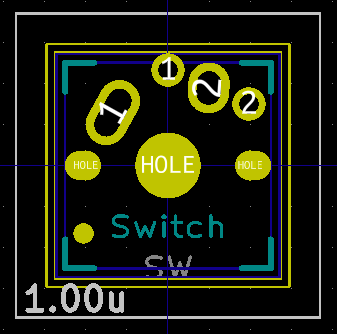
Triple_PCB_125H | One-sided 1.25u mount for any MX-compatible switches, Alps switches, and Kailh Choc low-profile switches. Supports PCB mount switches. | 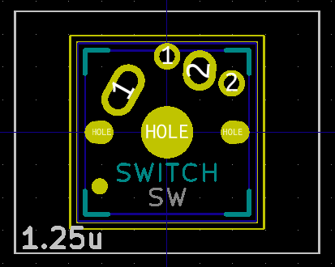
Triple_PCB_150H | One-sided 1.5u mount for any MX-compatible switches, Alps switches, and Kailh Choc low-profile switches. Supports PCB mount switches. | 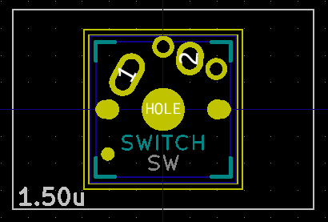
Triple_PCB_175H | One-sided 1.75u mount for any MX-compatible switches, Alps switches, and Kailh Choc low-profile switches. Supports PCB mount switches. | 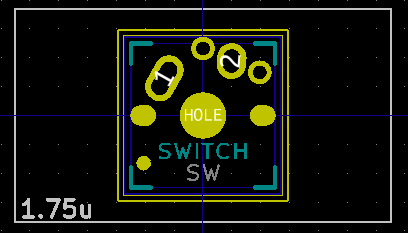
Triple_PCB_200H | One-sided 2u mount for any MX-compatible switches, Alps switches, and Kailh Choc low-profile switches. Supports PCB mount switches. | 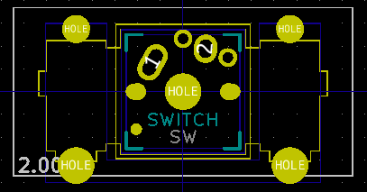
Triple_PCB_200V | One-sided 2u **vertical** mount (e.g. ISO Enter) for any MX-compatible switches, Alps switches, and Kailh Choc low-profile switches. Supports PCB mount switches. | 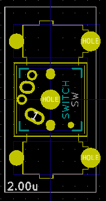
Triple_PCB_225H | One-sided 2.25u mount for any MX-compatible switches, Alps switches, and Kailh Choc low-profile switches. Supports PCB mount switches. | 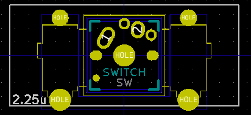
Triple_PCB_275H | One-sided 2.75u mount for any MX-compatible switches, Alps switches, and Kailh Choc low-profile switches. Supports PCB mount switches. | 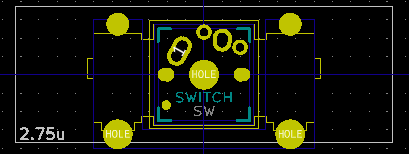
Triple_PCB_625H | One-sided 6.25u mount for any MX-compatible switches, Alps switches, and Kailh Choc low-profile switches. Supports PCB mount switches. | 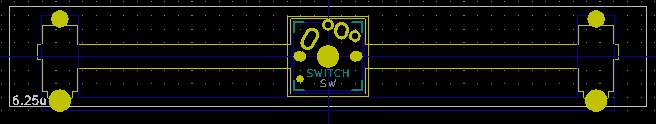
Triple_PCB_200H-v-flip | One-sided 2u mount for any MX-compatible switches, Alps switches, and Kailh Choc low-profile switches. Supports PCB mount switches. Switch footprint is vertically flipped and stabilizer holes are not. | 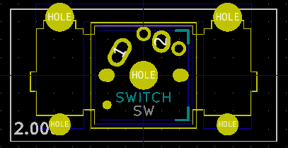
Triple_PCB_200V-h-flip | One-sided 2u **vertical** mount for any MX-compatible switches, Alps switches, and Kailh Choc low-profile switches. Supports PCB mount switches. Switch footprint is horizontally flipped and stabilizer holes are not. | 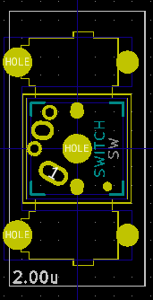
Triple_PCB_225H-v-flip | One-sided 2.25u mount for any MX-compatible switches, Alps switches, and Kailh Choc low-profile switches. Supports PCB mount switches. Switch footprint is vertically flipped and stabilizer holes are not. | 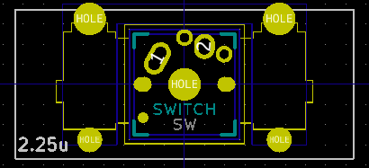
Triple_PCB_275H-v-flip | One-sided 2.75u mount for any MX-compatible switches, Alps switches, and Kailh Choc low-profile switches. Supports PCB mount switches. Switch footprint is vertically flipped and stabilizer holes are not. | 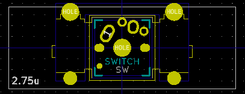
Triple_PCB_625H-v-flip | One-sided 6.25u mount for any MX-compatible switches, Alps switches, and Kailh Choc low-profile switches. Supports PCB mount switches. Switch footprint is vertically flipped and stabilizer holes are not. | 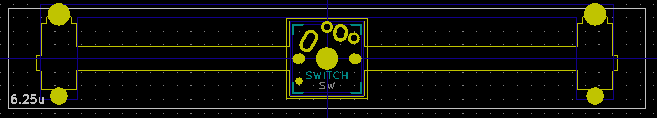

- Plate mount (**WIP**)

Footprint | Description/notes | Preview
--------- | ----------------- | -------
Triple_Plate_100H | One-sided 1u mount for any MX-compatible switches, Alps switches, and Kailh Choc low-profile switches. Supports Plate mount switches. |
: | : | :

### Dual mount

- PCB mount

Footprint | Description/notes | Preview
--------- | ----------------- | -------
Triple_PCB_100H-dual | Dual 1u mount for any MX-compatible switches and Kailh Choc low-profile switches. Supports PCB mount switches. | 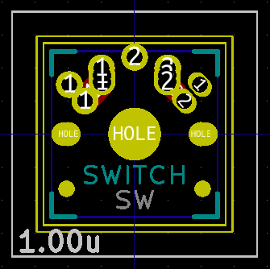
Triple_PCB_125H-dual | Dual 1.25u mount for any MX-compatible switches, Alps switches, and Kailh Choc low-profile switches. Supports PCB mount switches. | 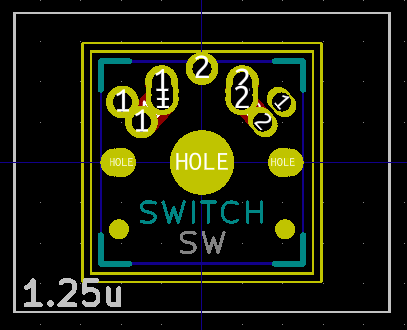
Triple_PCB_150H-dual | Dual 1.5u mount for any MX-compatible switches, Alps switches, and Kailh Choc low-profile switches. Supports PCB mount switches. | 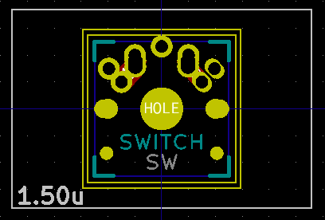
Triple_PCB_175H-dual | Dual 1.75u mount for any MX-compatible switches, Alps switches, and Kailh Choc low-profile switches. Supports PCB mount switches. | 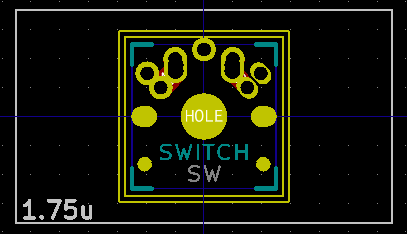
Triple_PCB_200H-dual | Dual 2u mount for any MX-compatible switches, Alps switches, and Kailh Choc low-profile switches. Supports PCB mount switches. | 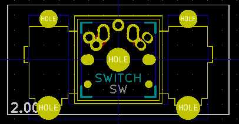
Triple_PCB_200V-dual | Dual 2u **vertical** mount (e.g. ISO Enter) for any MX-compatible switches, Alps switches, and Kailh Choc low-profile switches. Supports PCB mount switches. | 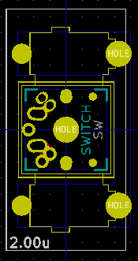
Triple_PCB_225H-dual | Dual 2.25u mount for any MX-compatible switches, Alps switches, and Kailh Choc low-profile switches. Supports PCB mount switches. | 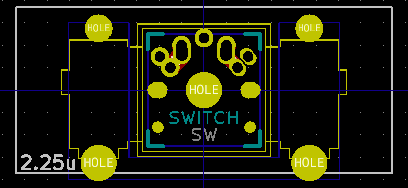
Triple_PCB_275H-dual | Dual 2.75u mount for any MX-compatible switches, Alps switches, and Kailh Choc low-profile switches. Supports PCB mount switches. | 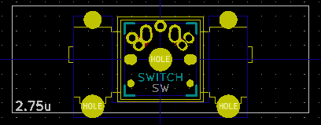
Triple_PCB_625H-dual | Dual 6.25u mount for any MX-compatible switches, Alps switches, and Kailh Choc low-profile switches. Supports PCB mount switches. | 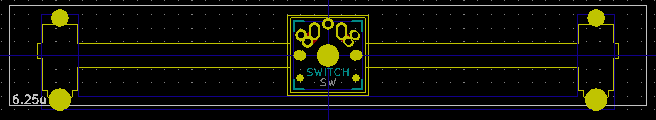
Triple_PCB_200H-dual-v-flip | Dual 2u mount for any MX-compatible switches, Alps switches, and Kailh Choc low-profile switches. Supports PCB mount switches. Switch footprint is vertically flipped and stabilizer holes are not. | 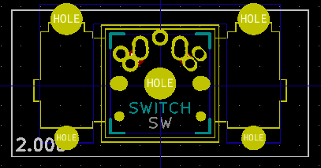
Triple_PCB_200V-dual-h-flip | Dual 2u **vertical** mount for any MX-compatible switches, Alps switches, and Kailh Choc low-profile switches. Supports PCB mount switches. Switch footprint is horizontally flipped and stabilizer holes are not. | 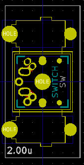
Triple_PCB_225H-dual-v-flip | Dual 2.25u mount for any MX-compatible switches, Alps switches, and Kailh Choc low-profile switches. Supports PCB mount switches. Switch footprint is vertically flipped and stabilizer holes are not. | 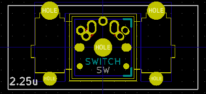
Triple_PCB_275H-dual-v-flip | Dual 2.75u mount for any MX-compatible switches, Alps switches, and Kailh Choc low-profile switches. Supports PCB mount switches. Switch footprint is vertically flipped and stabilizer holes are not. | 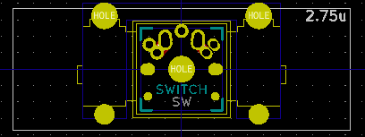
Triple_PCB_625H-dual-v-flip | Dual 6.25u mount for any MX-compatible switches, Alps switches, and Kailh Choc low-profile switches. Supports PCB mount switches. Switch footprint is vertically flipped and stabilizer holes are not. | 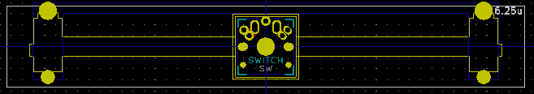

- Plate mount (**WIP**)

Footprint | Description/notes | Preview
--------- | ----------------- | -------
Triple_Plate_100H-dual | Dual 1u mount for any MX-compatible switches, Alps switches, and Kailh Choc low-profile switches. Supports Plate mount switches. |
: | : | :

## Note

- I do not know whether PCB manufacturers allow overlapping drill holes or not :sweat_smile:

------------------------

## LICENSE

The original library is released under [MIT license](https://github.com/keebio/Keebio-Parts.pretty/blob/master/LICENSE) by Keebio (c) 2018.  
This folk is also provided under [MIT license](LICENSE) by urushiyama (c) 2019.
